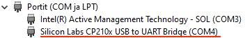
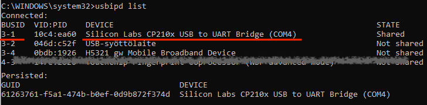
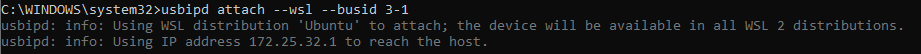
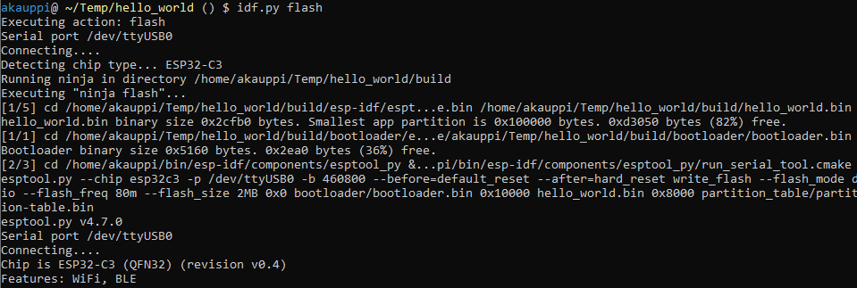
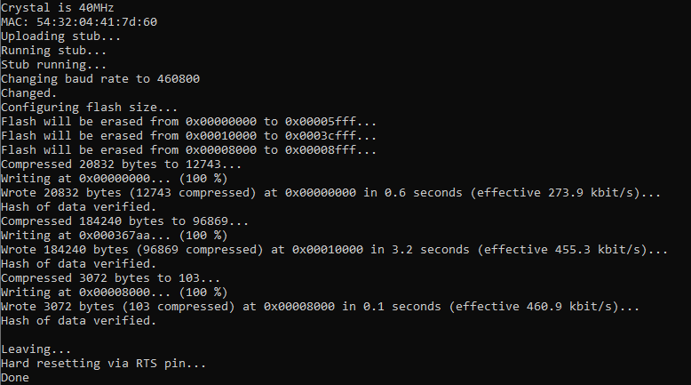
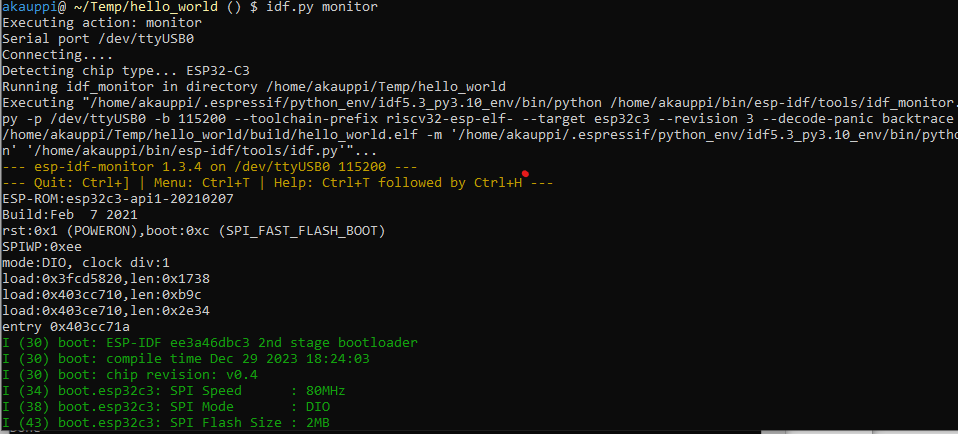
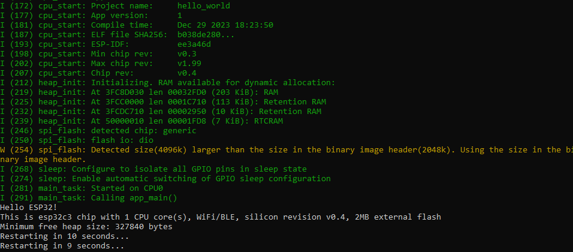

# ESP32 on WSL

Instructions on how to set up ESP32 toolchain using WSL2 and Windows. 

>If you rather work on Mac, see the very similar sister repo [ESP32 on Mac](https://github.com/lure23/ESP32-Mac).


## Aim ⛳️

- Minimal software installs on the host (Windows)
- Ability to flash the device from within WSL

### Comparison with existing instructions

- [Getting started with the ESP-IDF running under WSL2](https://andres.world/getting-started-with-the-esp-idf-running-under-wsl2.html) (blog, Jul 2021)

	Does flashing on the Windows side, which means installing tools on the host (e.g. Python). We only need device drivers and `usbipd-win` on Windows side.


## Requirements

- Windows 10
- WSL2 installed

The instructions have been tested on following boards:

- [ESP32-C3-DevKitC-02](https://docs.espressif.com/projects/esp-idf/en/latest/esp32c3/hw-reference/esp32c3/user-guide-devkitc-02.html)


>Note: The repo covers RISC V based development kits, only. If you have an Xtensa based chip and are willing to keep supporting this repo (test against such boards), let the author know. :)

<sub>The instructions likely work for Windows 11 as well, but the author is not in a position to confirm this.</sub>

<!-- 
Developed on:
- Windows 10 Home
   - CP210x universal Windows driver (11.3.0)
- usbipd-win v. 4.2.0; direct install
- WSL version 2.1.5.0 (> wsl --version); Ubuntu 22.04.4 LTS
-->


## Warning!!

When plugging the ESP32-C3-DevKitC-02 development board for the first time, <font color=aqua>**BEWARE OF THE STRONG LED LIGHT!!**</font> The author used a tape on top, until he reflashed the device. 😎🩹


## Steps: set up USB-IP bridging

By bridging the USB device from your host (Windows) computer to the client (WSL), we are able to do all the development actions within the Linux side of things.


### Install CP210x bridge driver

Most ESP32 development boards use a Silicon Labs USB-to-UART chip, to allow communicating with the development board. A device driver for this chip needs to be installed on the *host* side - otherwise you won't be able to communicate with the board.

As per [Getting started with the ESP-IDF running under WSL2](https://andres.world/getting-started-with-the-esp-idf-running-under-wsl2.html) (blog, Jul 2021):

- Visit Silicon Labs > Developers > [CP210x USB to UART Bridge VCP Drivers](https://www.silabs.com/developers/usb-to-uart-bridge-vcp-drivers) 
   - Download the latest `CP210x Universal Windows Driver` (11.3.0 at the time of writing)
   - unzip and follow the instructions

>After installation, you should be able to see device information in the Device Manager:
>
>


### Update WSL

Let's make sure you've got the latest WSL host support.

1. Open an Admin command prompt in Windows, in it:

   ```
   > wsl --update
   ```

### Reconfigure WSL

Without this, the USB stick wouldn’t have the right access rights (group `dialup`), later on, and flashing wouldn’t work from within WSL.

- Follow [this advice](https://askubuntu.com/questions/1408365/wsl-how-do-i-set-the-group-for-a-tty-device) (Ask Ubuntu, Jan 2023):

   - Within WSL, create a file called `/etc/wsl.conf`

      ```
      $ sudo nano /etc/wsl.conf
      ```

      ..with contents:
      
      ```
      [boot]
      systemd=true
      ```

   - In Windows (admin prompt):

      `> wsl --shutdown`


### Install `usbipd-win`

Read the instructions at the [project website](https://github.com/dorssel/usbipd-win) (GitHub).

With the `usbipd` service installed, we can grab the development board on the Windows side.


### Set up `usbip` connection

- In an admin command prompt:

   ```
   > usbipd list
   ```

   
   
   ```
   > usbipd bind -b 3-1
   ```

   Taking the particular device (see bus id, above) to use, for attaching to a client.
   
   ```
   > usbipd attach —-wsl —-busid 3-1
   ```

   

   Whereas `bind` are persisted over restarts, you will need to repeat the `usbipd attach` command every time you restart your computer.

   >Note: Not sure if this is true any longer, with `usbipd` v.4.2.0. There may be ways to keep the attaching automatic. Please send a PR.

- The device should now be seen under WSL:

   ```
   $ ls -al dev/tty*
   ...
   crw-rw---- 1 root dialout 188, 0 Dec 29 18:09 /dev/ttyUSB0
   ...
   ```

   Make note of the device name (it may be different for you), and ensure that group `dialout` has `rw` access to the device.
   
   This is a good place to add yourself to the `dialout` group, so you don't need `sudo` to flash the device.

   ```
   $ sudo usermod -a -G dialout $USER
   ```
   
   Fine? The rest of the steps will take place on the WSL side. We'll install ESP-IDF development tools and flash a sample program to your device.


## Steps: Set up ESP-IDF

Follow the instructions on [Standard Toolchain Setup for Linux and macOS](https://docs.espressif.com/projects/esp-idf/en/latest/esp32c3/get-started/linux-macos-setup.html) (Espressif docs):

- Install the pre-requisites:

   ```
   $ sudo apt-get install git wget flex bison gperf python3 python3-pip python3-venv cmake ninja-build ccache libffi-dev libssl-dev dfu-util libusb-1.0-0
   ```

- Create an installation folder

   >Note: Espressif advocates installing to `~/esp/esp-idf` but the author preferred `~/bin/esp-idf`. Pick your own way, but be consistent.
   >
   >Important: The `esp-idf` is a shallow copy git repo, and the way to do updates is simply to **re-install it from `git clone`.**

   ```
   $ mkdir -p ~/bin		# or ~/esp
   $ cd ~/bin
   $ git clone --depth 1 --recursive https://github.com/espressif/esp-idf.git
	```

   This downloads the current ESP-IDF sources into the `esp-idf` folder.
   
   >Note: Adding `--depth 1` is by this author. Reduces your disk use slightly, though it doesn't cover sub-repos.

   ```
   $ cd esp-idf
   $ ./install.sh esp32c3
   ```
   
   Here, you'll add the kinds of development board support that you need / have access to.

   ```
   $ . ./export.sh
   ```

   Adds environment variables to your current shell, so `idf.py` (the build command) can be used.
	
	>Hint: You'll need to rerun this every time a new shell is being used, so might be useful to make an alias for it.
	>
	>The author has: `alias idf-init=". ~/bin/esp-idf/export.sh`` in `~/.bashrc`.

   Done!  
   
   ```
   $ cd   # get out of ~/bin
   ```	

## Sample project

Note: Remember that you have the ESP-IDF environment variables set up (as mentioned earlier):

```
$ . ~/bin/esp-idf/export.sh
```

---

Pick a folder where you'd have a sample project. Let's say `~/my`.

```
$ install -d my
$ cd my
```

Copy a sample project to this folder

```
$ cp -r $IDF_PATH/examples/get-started/hello_world hello
```

```
$ cd hello
```

>Optional: Change something in the sources, eg. "Hello world" to - say - "Hello ESP32". `nano main/hello_world_main.c`

```
$ idf.py set-target esp32c3
```

This (likely??) is a one-time command, to instruct ESP-IDF which board we are targeting.

>Optional: You can try `idf.py menuconfig` that allows all kinds of project settings to be changed. We are good with the defaults.


### Build and flash

```
$ idf.py build
```

This builds the files `build/hello_world.*`:

```
-rw-rw-r--  1 ubuntu ubuntu  184240 Dec 30 19:08 hello_world.bin
-rwxrwxr-x  1 ubuntu ubuntu 3776388 Dec 30 19:08 hello_world.elf
-rw-rw-r--  1 ubuntu ubuntu 3060919 Dec 30 19:08 hello_world.map
```

>Note: The files look rather big, but this is a debug build.

```
$ idf.py flash
```




This command guesses the `/dev/ttyUSB0` target correctly, and writes the program to the device.

Now, how to know anything really happened??

```
$ idf.py monitor
```




We can spot the "Hello, ESP32!" among the output. Great!!!


>NOTE: Ctrl-C does not break you away from the `idf.py monitor`. The break key is `Ctrl-]` <sub>[source](https://espressif-docs.readthedocs-hosted.com/projects/esp-idf/en/v3.3.5/get-started/idf-monitor.html)</sub> but ON A Swedish/Finnish KEYBOARD that’s `Ctrl-¨` (the key for `^¨~`).
>
>|locale|break key|
>|---|---|
>|en|`Ctrl-[`|
>|se/fi|`Ctrl-¨`|
>||*contribute your locale*|


## Outcome

We have set up the development tools fully within WSL. On the Windows side, we needed to install one device driver and the `usbipd` server.

All further work would happen solely within your WSL environment. You can install Rust, install IDE's that support WSL "remote development", or just develop with the tools we already went through.

Make great things!


## Appendix

### Uninstalling the device driver

The Release Notes of the CP210x driver have this to say:

```
[...]
UNINSTALLING
------------
1. The device must be plugged in
2. Run Device Manager
3. Locate the device you want to uninstall
4. Right click on the device and choose "uninstall"
5. Follow the instructions
```

### Updating ESP-IDF

Since it's a git clone, you can `git pull`.

However, Espressif recomments to "clear `~/esp/esp-idf` and clone again”.


## References

- [WSL: how do I set the group for a tty device](https://askubuntu.com/questions/1408365/wsl-how-do-i-set-the-group-for-a-tty-device) (SO; May 2022)
