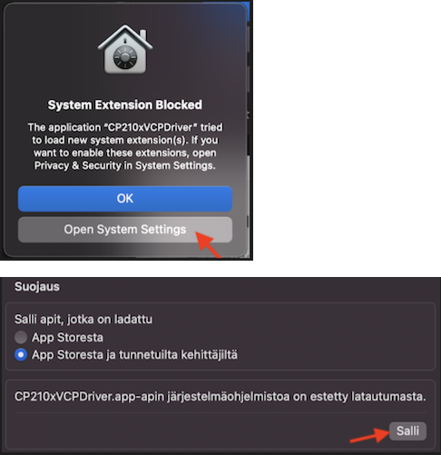
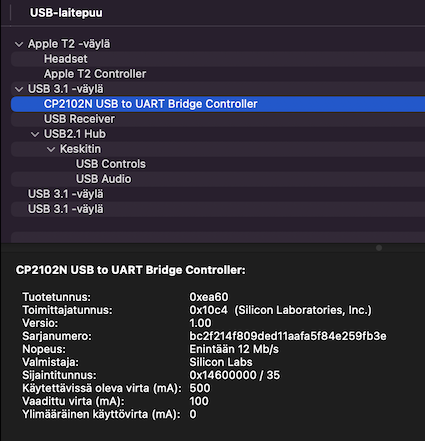
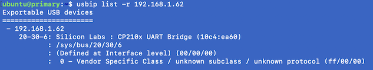

# What about Mac?

What if you have a Mac, instead of a Windows PC? Is sandboxed ESP32 development a possibility?

Let's find out!

>Note: Sandboxed development is definitely possible (and should be easy) by using virtualization software such as VirtualBox, Parallels and so on. We rule those out, because.. just because.
>
>The author is keen to know, whether Multipass can be used for embedded development.

## Approaches

- Have [Multipass](http://multipass.run/) replace WSL, as the Linux VM.

- Have Windows connect to the device, with Multipass routing to it, via usbip.

- Run IDE on Mac, but direct the Remote Development to the WSL instance on a Windows PC (where the development kit is physically connected).


These are the approaches that initially came to mind. There may be more, and one may ask "what's the point"? For the author, it's about finding a sweet spot of convenience (using Mac for desktop stuff), practicality and ...perhaps... exploration?

Let's see each of the approaches in turn.

>Note: For the remainder of the document, it's more like a (less detailed) log book, than the detailed instructions in the `README.md`. The point is to scout and identify the reasons why some approach cannot be (yet) utilized. It's like going in caves, until one cannot.

||toolchain|filesystem|device|
|---|---|---|---|
|Cave a|Multipass|Mac|Mac|
|Cave b|Multipass|Mac|Windows|
|Cave c|WSL|WSL|Windows|

In all the caves, IDE runs on Mac, using Remote Development.


### Cave a. Mac only

Requires:

- access to Mac
- Multipass installed

This option is "Mac only" and close to using a (commercial or VirtualBox) virtualization system.

#### Install a driver

As with Windows, macOS requires the [CP210x USB to UART Bridge VCP Drivers](https://www.silabs.com/developers/usb-to-uart-bridge-vcp-drivers) to be installed, in order to communicate with the ESP32-C3-DevKitC-02 board.

<details><summary>Details...</summary>

Download, unzip, install.

Uninstalling can be done using the `uninstall.sh` script from the installation package. In case you missed, it's here:

```
#!/bin/bash

if [ -d /System/Library/Extensions/SiLabsUSBDriver.kext ]; then
sudo kextunload /System/Library/Extensions/SiLabsUSBDriver.kext
sudo rm -rf /System/Library/Extensions/SiLabsUSBDriver.kext
fi

if [ -d /System/Library/Extensions/SiLabsUSBDriver64.kext ]; then
sudo kextunload /System/Library/Extensions/SiLabsUSBDriver64.kext
sudo rm -rf /System/Library/Extensions/SiLabsUSBDriver64.kext
fi

if [ -d /Library/Extensions/SiLabsUSBDriverYos.kext ]; then
sudo kextunload /Library/Extensions/SiLabsUSBDriverYos.kext
sudo rm -rf /Library/Extensions/SiLabsUSBDriverYos.kext
fi

if [ -d /Library/Extensions/SiLabsUSBDriver.kext ]; then
sudo kextunload /Library/Extensions/SiLabsUSBDriver.kext
sudo rm -rf /Library/Extensions/SiLabsUSBDriver.kext
fi

if [ -d /Applications/CP210xVCPDriver.app/Contents/Library/SystemExtensions/com.silabs.cp210x.dext ]; then
/Applications/CP210xVCPDriver.app/Contents/MacOS/CP210xVCPDriver uninstall
sudo rm -rf /Applications/CP210xVCPDriver.app
fi
```



Allow the system extension, as part of the install.
</details>

Can we see the device in macOS?

Yes, we can!



>System Preferences > General > System report... > USB


#### State of `usbipd` on macOS

The usbipd choices are rather limited (late 2023). The author tried [Rust based `usbip` server](https://github.com/jiegec/usbip) (GitHub), which requires one to have Rust installed on the Mac.

<!-- skipping installation and cloning -->

```
$ env RUST_LOG=info cargo run --example host
```

To get the IP of the host (macOS):

```
$ ipconfig getifaddr en0
192.168.1.62
```

>That's for the default (wired) connection. Option-click on the WLAN icon if you are using WLAN.

Now, can we access the USB stick from Multipass?

<!-- Installation of Multipass skipped -->

**Within Multipass:** (`multipass shell`)

- Install `usbip` client

   ```
   $ sudo apt-get install linux-tools-generic
   ```

- List host devices:

   ```
   $ usbip list -r 192.168.1.62
   ```

   

   Seems we can see it. `20-30-6` is the "bus id"; keep that in mind.

- Attach

   ```
   $ usbip attach -r 192.168.1.62 -b 20-30-6
   ```
   
   So close!  This fails, likely because the device hasn't been "bound" anywhere. Can we do that on the macOS side?
   
   - Opened [Host example Mac to Linux - is a "bind" necessary?](https://github.com/jiegec/usbip/issues/38).

      - [ ] See if we get responses

---

It looks to the author, as if:

- `usbip bind -b {bus-id}` is always required, on the host side. All samples have it, but the Rust `usbipd` repo doesn't even mention bind. This may be due to it being designed for simulation; perhaps host support is not that strong?
- Cannot do bind remotely.
- Did not find an open source `usbip` client for MacOS; that could do it...

= 🚧🚧🚧

---


### Cave b. Mac + share device through Windows


### Cave c. IDE on Mac; rest in WSL


